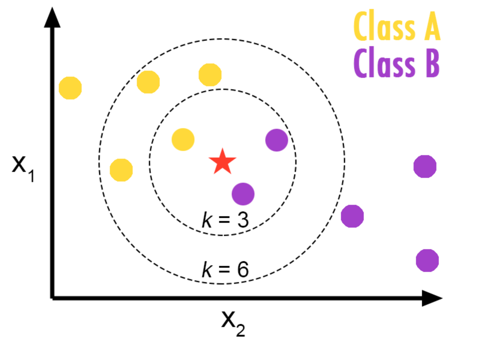

## 
Classification

- Classification is a supervised learning approach, which can be thought of classifying some unknown items into a discrete set of "classes".
- Classification attempts to learn the relationship between a set of feature variables and a target variablle of interest. 
- The target variable in classification is a categorical with discrete values. 

### How classification and classifiers work?
**Scenario**:
- suppose a bank is concerned about the potential for loans not to be repaid. 
- the bank can use the previous loans data to predict which customers are likely to have problem of repaying loans. 
- the data can be used to classify a "bad risk" customer. 
- the goal of the prediction is to use the previous data such as age, income, education, etc. to build a classifier to classify new incoming customer then label them as 0 (bad risk) and 1 (okay). 

### The use of classification
- email filtering
- speech recognition
- handwriting recognition
- biometric identification
- documents classification, etc.

### Alagoritm in Machine Learning
- Decision Trees
- Naive Bayes
- Linear Discriminant Analysis
- K-nearest neighbor
- Logistic regression
- Neural Networks
- Support Vector Machines (SVM)

### K-Nearest Neighbor (KNN)
- it is a classification algorithm that takes a bunch of labelled points and uses them to learn how to label other points. 
- classifies cases based on the similarity to other cases.
- data points that are near each other are called or said to be neighbors. 
- "similar cases with the same class labels are near each other". 
- The similarity of two data points are seen based on the distance. 

### How to calculate/evaluate similarity and disimilarity?
- Euclidean distance 

### How KNN works?
1. pick the value for K
2. calculate the distance for the new case
3. Search for the K observations in the training data that are ‘nearest’ to the measurements of the unknown data points
4. predict the response of the unknown data point using the most popular response value from
the K nearest neighbors.

#### How to calculate similarity between two data points?
- Assume we have two customers; 1 and 2.
- These two customers have only one feature; Age. 
- We can easily use a specific type of Minkowski distance to calculate the distance of these
2 customers. (Euclidean distance)
- Leter

#### How do we choose the right K?
To find the right K, we do the iterative process. Use different number of K and verify the accuracy of each K using test set.

**Scenario**:
A telecomunication company trying to analyse and group its customers usage pattern based on demographic data. The target variable has four possible groups: basic service, e-service, plus service and total service. 

### Evaluation Metrics in Classification
After we build a model, we need to ask how accurate our model is. Evaluation metrics provide a key role in the development of a model, as they provide insight to areas that might require improvement. 

#### Types of Evaluation Metrics
There are many, but here are some:
-  Jaccard index
-  F1-score
-  Log loss

**Jaccard index**
- The simplest evaluation metrics
- Known as jaccard similarity index
- JI is the size of the intersection divided by the size of the union of two label set. 
- Example:
  -   0.66.

Knn Illustration
