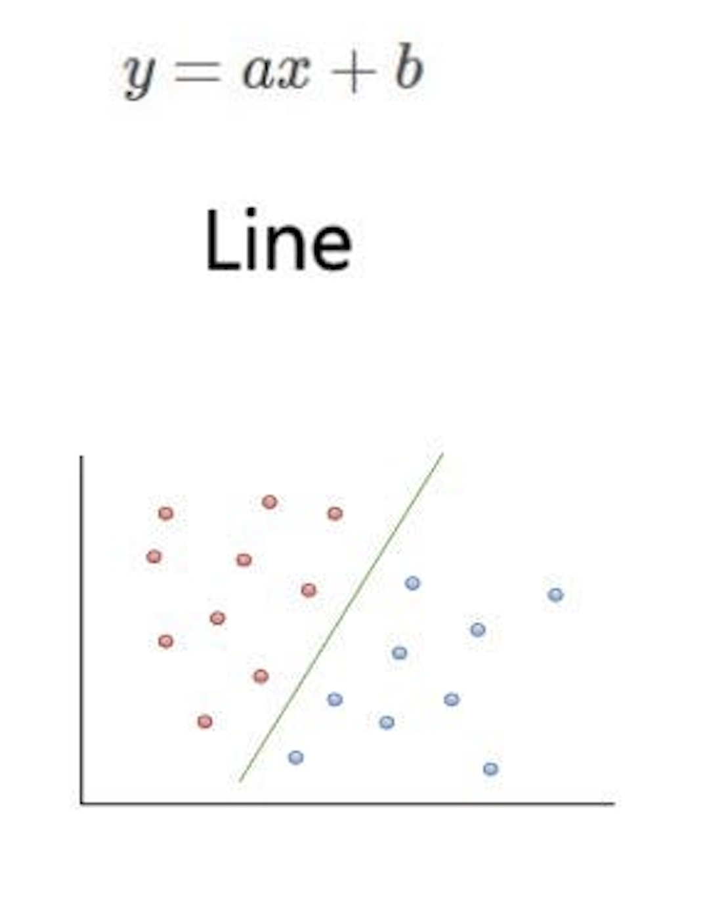
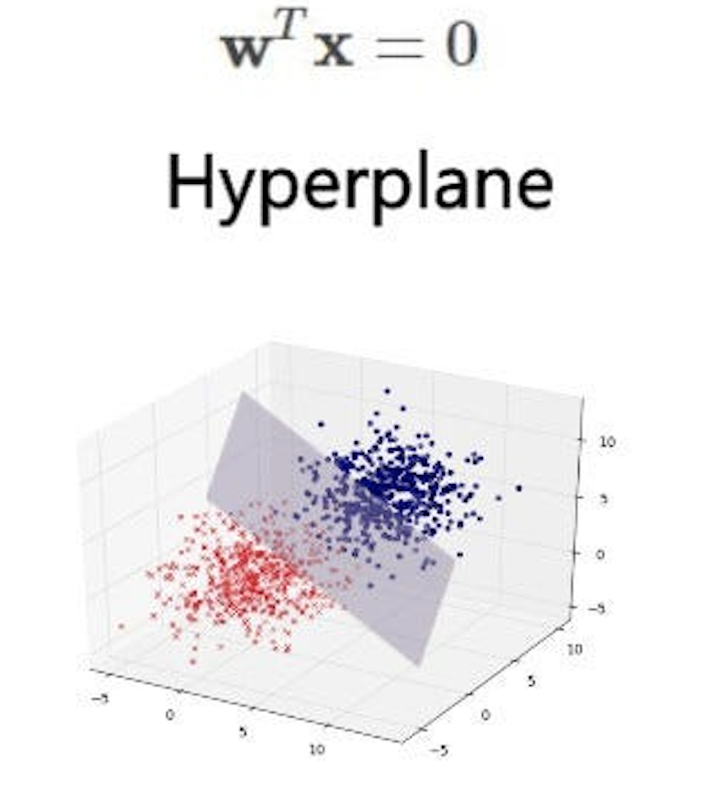

# Support Vector Machine (SVM)
- It is used for classification. Imagine This scenario, we have patients' data who were believed to be at risk of developing cancer. Benign and malignant have its own charcteristics. We can use all of this characteristic to classify either new patient might be benign or malignant. For that, we can use SVM as a classifier. 
- It is a supervised machine learning algo that classifies cases by finding a separator. 

## How SVM Works?
- mapping data to a high dimensional feature space.
- finding separator.
  
## Why SVM?
- imagine a dataset where the data points fall into two different categories but it linearly non-separable dataset. 
- the two categories can be separated with a curve but not a line, of course because they bot linear. 

**So how does SVM solves this?**
1) This is how the data looks like in 2d space:
  

2) then, it maps the data to high-dimensional feature space and find the separator, showed as a hyperlane.
    

**Questions**
1. How does SVM make line (plane in 3d space) to separate complicated clusters?
2. How can we find the most optimized hyperlane separator after transformation?

**Data Transformation**
****